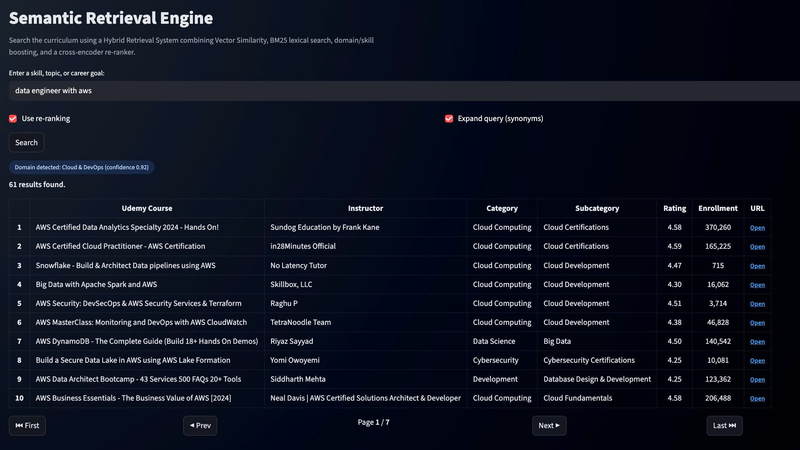
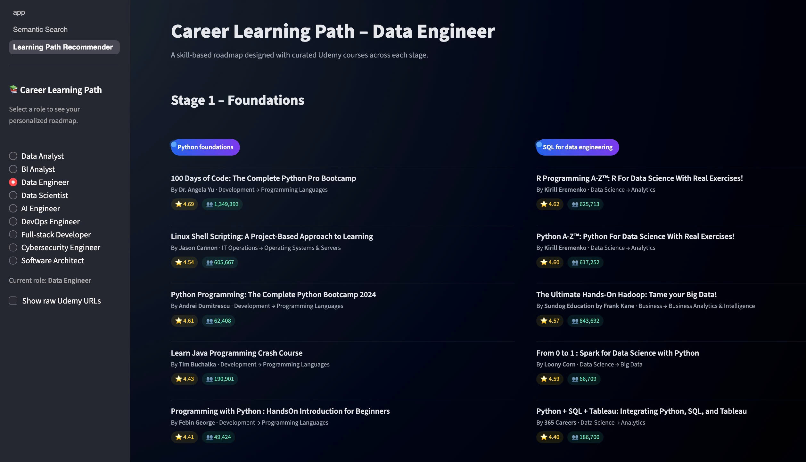

# UdemyCourseAtlas Semantic Engine  
#### A semantic search and learning-path engine powered by modern NLP, retrieval methods, and data engineering workflows.

I previously worked at Udemy, where I gained exposure to large-scale course discovery systems. Inspired by Udemy’s new AI-driven learning paths, I built this independent project to explore semantic search and learning-path generation using open-source tools.

This system applies a full-stack semantic retrieval architecture that combines dbt transformations, Prefect orchestration, SBERT embeddings, FAISS indexing, hybrid ranking, skill-based learning path generation, and a Streamlit application.

It processes a raw Udemy Business course export and converts it into a dbt-modeled, multi-layer retrieval platform spanning: Ingestion → Transformation → Embedding & Indexing → Hybrid Retrieval → Learning Path Engine → Application UI.


---

## 🖥️ Demo Preview

Representative screenshots demonstrating both the **Semantic Retrieval Engine** and the **Learning Path Generator**.  
These images highlight the core functionality, while the full interactive experience is available inside the application.

#### Semantic Retrieval Engine  
Hybrid semantic search combining SBERT embeddings, BM25 lexical scoring, domain/skill boosting, and optional cross-encoder reranking.

<p align="center">
  
   <br>
  <em>Figure 1. Semantic search results for the query “data engineer with aws”. Domain detected: Cloud & DevOps (confidence 0.92).</em>
</p>
    
#### Learning Path Generator — Data Engineer (Stage 1 Preview)

A curated, skill-based roadmap generated from semantic retrieval, course clustering, and ranking logic.  
Stage 1 focuses on Python foundations and SQL essentials for modern data engineering roles.

<p align="center">
  
   <br>
  <em>Figure 2. Stage 1.1 of the Data Engineer learning path.</em>
</p>


---


# 1. System Architecture Overview

<p align="center">
  
   <br>
  <em>Figure 3. High-level architecture of the UdemyCourseAtlas Semantic Engine.</em>
</p>

## **Six-Core Layers**

---

## **Layer 1 — Data Transformation (dbt Project)**  
`/learning_dbt/`

Implements a **local warehouse-style transformation layer** using dbt and DuckDB.

**Key responsibilities:**

- Normalize schema  
- Clean and standardize text fields  
- Cast types & handle missing values  
- Derive semantic fields:
  - `embedding_text`
  - `search_text`
  - `domain_text`

**Outputs:**  
`unified_courses_v1.csv` — analytics-ready, warehouse-modeled dataset.

---

## **Layer 2 — Embedding Layer (Sentence Transformers)**  
Notebook: `02_embedding_faiss_and_learning_path.ipynb`

- Model: **SBERT MiniLM (all-MiniLM-L6-v2)**
- Batch inference: 26k+ courses, batch size 64
- Embedding dimension: 384  
- Exported artifacts:
  - `course_embeddings.npy`
  - Fine-tuned model support (HuggingFace-ready)

**Goal:** Convert each course into dense semantic vectors for retrieval.

---

## **Layer 3 — Indexing Layer (FAISS Vector Store)**  

- FAISS IndexFlatIP (cosine similarity)
- Memory-mapped binary index:
  - `faiss_index.bin`
- <10ms retrieval latency
- Persistent + reloadable in the Streamlit app

**Goal:** Enable high-speed, scalable semantic search over the catalog.

---

## **Layer 4 — Hybrid Retrieval Engine (Python)**  
Folder: `/search_engine/`

A custom **hybrid search engine** combining:

#### **1. Semantic Vector Search (FAISS + SBERT)**
#### **2. Keyword Lexical Scoring** (idf-weighted)
#### **3. Domain Anchor Reweighting**  
(e.g., Python, Data Science, Cloud, PM, Finance)

#### **4. Metadata Signals**
- Category match  
- Subcategory match  
- Popularity normalization (log enrollments)

#### **5. Score Fusion**
Weighted hybrid score → ranking → deduplication

**Output:**  
Clean, ranked course recommendations for any natural-language query.

---

## **Layer 5 — Learning Path Engine (Skill Graph + Retrieval)**  
File: `app/utils_learning_path.py`

Implements a **4-stage role-based curriculum generator**:

1. **Foundations**  
2. **Core Skills**  
3. **Specialization**  
4. **Portfolio & Certification**

**Supported Roles:**  
Data Analyst, BI Analyst, Data Scientist, AI Engineer, DevOps, Cloud, Product Manager, Cybersecurity, Full-Stack, etc.

For each skill:

- Run hybrid search  
- Select top-5 high-quality courses  
- Return JSON-like structure rendered in UI

---

## **Layer 6 — Application Layer (Streamlit UI)**  
Folder: `/app/`

A polished, multi-page Streamlit application featuring:

- Page 1: **Semantic Search Explorer**  
- Page 2: **Learning Path Generator**
- Cached artifact loading (`st.cache_resource`)
- Custom CSS theme and gradient UI styling
- Course cards, ranking tables, expandable sections

**Goal:** Provide an interactive, production-like interface.

---

# 2. Repository Structure

```
semantic-course-navigator/
│
├── app/
│   ├── app.py               # Main Streamlit entry point
│   ├── pages/
│   ├── utils.py             # Hybrid retrieval engine
│   └── utils_learning_path.py
│
├── learning_dbt/            # dbt project for data modeling
│
├── orchestration/prefect/   # Prefect workflow orchestration
│
├── search_engine/
│   └── search_engine_v2.py
│
├── notebooks/
│   ├── 01_topic_search.ipynb
│   └── 02_embedding_faiss_and_learning_path.ipynb
│
├── model/
│   └── miniLM_finetuned_udemy/  # Optional fine-tuned SBERT
│
├── data/
│   ├── unified_courses_v1.csv
│   ├── course_embeddings.npy
│   └── faiss_index.bin
├── assets/
│   └── demo/                # Demo screenshots for README
├── requirements.txt
├── requirements_de.txt      # DE + Prefect + dbt dependencies
├── README.md
└── .gitignore
```

---

# 3. Technical Highlights

## **A. NLP & Embeddings**
- SBERT MiniLM (all-MiniLM-L6-v2)
- Embedding inference over 26k+ items
- Fine-tuning ready (HuggingFace-compatible)
- Cosine similarity retrieval

## **B. Information Retrieval**
- FAISS IndexFlatIP (vector search)
- Hybrid scoring: semantic + lexical + metadata
- Domain reweighting via anchor embeddings
- Deduplicated, ranked results

## **C. Data Engineering**
- dbt Warehouse Modeling (DuckDB)
- Text normalization & schema unification
- Feature engineering (embedding_text, search_text)
- Exported reproducible artifacts

## **D. Orchestration & MLOps**
- Prefect workflow orchestration  
- Version-controlled pipelines  
- Caching, reproducibility, environment pinning  
- HuggingFace model hosting (optional)

## **E. Application Layer**
- Streamlit multi-page UI  
- Embedding + FAISS lazy loading  
- Custom UI components  
- Easily deployable app

---

# 4. Quickstart (Local Development)

## **1. Install dependencies**
```bash
pip install -r requirements.txt
```

## **2. Run the App**
```bash
streamlit run app/app.py
```

Artifacts automatically load:

- `unified_courses_v1.csv`
- `course_embeddings.npy`
- `faiss_index.bin`

> Optional: dbt models and Prefect flows are included for the data engineering pipeline, but not required to run the Streamlit application.

---

# 5. Future Works & Next Steps

### **1. Semantic Layer Integration**
Add a MetricFlow semantic layer for AI-driven metric queries  
(e.g., enrollment_conversion_rate, popularity_momentum).

### **2. Cloud Vector DB Migration**
Move embeddings + FAISS to:
- Pinecone  
- Weaviate  
- Qdrant  
for scalable, distributed semantic search.

### **3. Cross-Encoder Re-Ranking**
Re-rank FAISS candidates with:
`cross-encoder/ms-marco-MiniLM-L-6-v2`

### **4. User Feedback Loop**
Collect "Was this helpful?" signals in Streamlit →  
Reinforcement Learning tuning for skills/path recommendations.

### **5. Observability & Monitoring**
Prefect logging, dbt test dashboards, latency monitoring, data quality KPIs.

---

# 6. Summary

**UdemyCourseAtlas Semantic Engine** is an end-to-end semantic retrieval and curriculum intelligence system combining:

- SBERT embeddings (fine-tuned ready)
- FAISS vector indexing
- Hybrid scoring & metadata-aware ranking
- dbt transformations + Prefect workflows
- Skill-based curriculum generator
- Streamlit UI for semantic exploration & personalized learning paths

Designed for scalable course search and personalized upskilling recommendations.

---

## Author

**Linh Phuong Nguyen (Claire Nguyen)**  

This project reflects ongoing work in applying modern NLP, retrieval systems, and data engineering practices to real educational challenges.  
By rebuilding a full semantic search and learning-path engine from the ground up—using open-source tools, production-ready pipelines, and modular system design—it demonstrates a practical approach to improving how learners discover content and navigate skill development.

The repository is shared openly to support others exploring EdTech, semantic search, or curriculum intelligence systems.  

